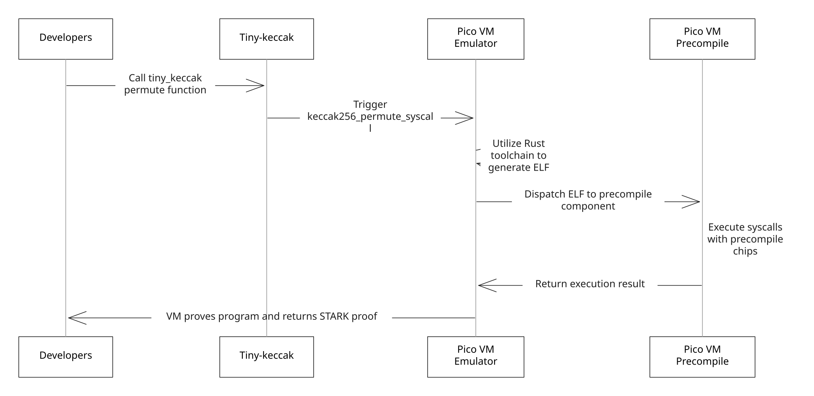

# Function-level

Function-level coprocessors—commonly known as precompiles—are specialized circuits within Pico designed to optimize and streamline specific cryptographic operations and computational tasks. These precompiles handle operations such as elliptic curve arithmetic, hash functions, and signature verifications. In a general-purpose environment, these operations can be resource-intensive, but by offloading them to dedicated circuits, Pico significantly reduces computational costs, improves performance, and enhances scalability during proof generation and verification. Packaging these core operations into efficient, well-tested modules not only accelerates development cycles but also establishes a secure foundation for a wide range of zk-applications, including privacy-preserving transactions, rollups, and layer-2 scaling solutions.

## Work Flow

Below is an example workflow of Keccak256 hash permutation precompile in Pico.

The Pico precompiles workflow involves several steps to efficiently execute and verify cryptographic operations. To illstrate how it works, we use Keccak-256 precompile as an example:

1. **Developer Preparation**: Developers begin by writing and preparing the necessary code, including the [tiny-keccak patch](https://github.com/brevis-network/tiny-keccak/tree/patch-v1.0.0-rv64) for cryptographic hashing functions. This library provides the core primitives needed for SHA2, SHA3, and Keccak-based operations.
2. **Tiny-Keccak Patch**: Pico uses a forked and zero-knowledge-compatible version of tiny-keccak (sourced from the public [debris repository](https://github.com/debris/tiny-keccak)). This patch optimizes hashing operations—particularly Keccak-256—to run efficiently within Pico.
3. **Keccak256 Precompile**: When a Keccak-256 hashing function is invoked, Pico’s Keccak256 precompile is triggered to handle the specific permutation operations. This specialized circuit, known internally as the `keccak256_permute_syscall`, is optimized for performance, minimizing overhead and improving provability.
4. **Rust Toolchain & ELF Generation**: The Rust toolchain compiles your code, including the tiny-keccak patch, into an Executable and Linkable Format (ELF) file, which is the RISC0's support for zkVM executables.

By following this workflow, developers can perform cryptographic operations more efficiently and securely, taking full advantage of Pico’s precompile features to reduce proof overhead and streamline the development of ZK apps.

## List of Syscalls

Pico is currently supporting [these syscalls](https://github.com/brevis-network/pico/blob/main/sdk/patch-libs/src/lib.rs).

## List of patches

Pico is currently supporting the following patches:

<table data-full-width="true"><thead><tr><th width="208">Patch Name</th><th width="400">Github link</th><th>branch</th></tr></thead><tbody><tr><td>tiny-keccak</td><td>https://github.com/brevis-network/tiny-keccak</td><td><a href="https://github.com/brevis-network/tiny-keccak/tree/patch-v1.0.0-rv64">patch-v1.0.0-rv64</a></td></tr><tr><td>sha2</td><td>https://github.com/brevis-network/hashes</td><td><a href="https://github.com/brevis-network/hashes/tree/sha2-0.10.9-rv64">sha2-0.10.9-rv64</a></td></tr><tr><td>sha3</td><td>https://github.com/brevis-network/hashes</td><td><a href="https://github.com/brevis-network/hashes/tree/sha3-0.10.8-v1.0.0-rv64">sha3-0.10.8-v1.0.0-rv64</a></td></tr><tr><td>bls12381</td><td>https://github.com/brevis-network/bls12_381</td><td><a href="https://github.com/brevis-network/bls12_381/tree/patch-v1.0.1-rv64">patch-v1.0.1-rv64</a></td></tr><tr><td>k256</td><td>https://github.com/brevis-network/elliptic-curves</td><td><a href="https://github.com/brevis-network/elliptic-curves/tree/k256-0.13.4-rv64">k256-0.13.4-rv64</a></td></tr><tr><td>p256</td><td>https://github.com/brevis-network/elliptic-curves</td><td><a href="https://github.com/brevis-network/elliptic-curves/tree/p256-0.13.2-rv64">p256-0.13.2-rv64</a></td></tr><tr><td>substate-bn</td><td>https://github.com/brevis-network/bn</td><td><a href="https://github.com/brevis-network/bn/tree/patch-v1.0.1-rv64">patch-v1.0.1-rv64</a></td></tr></tbody></table>
